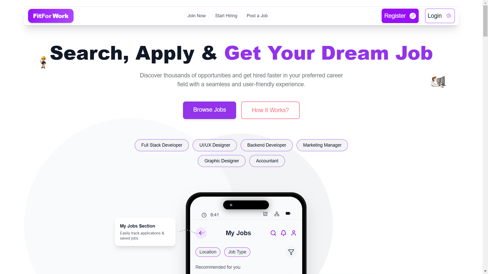
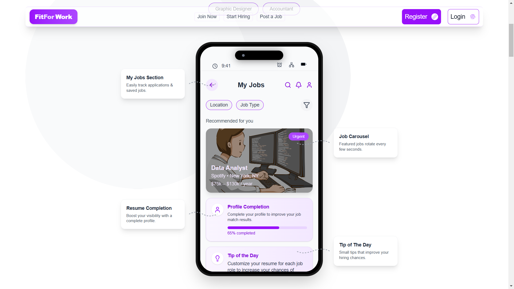
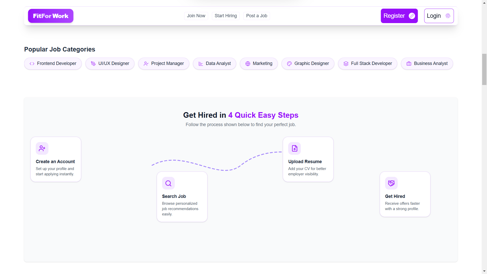
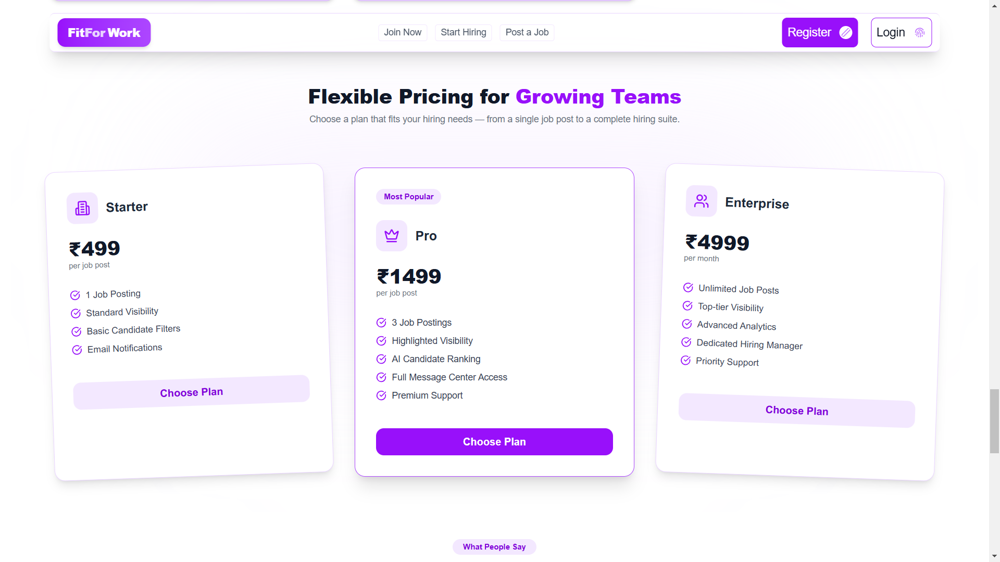
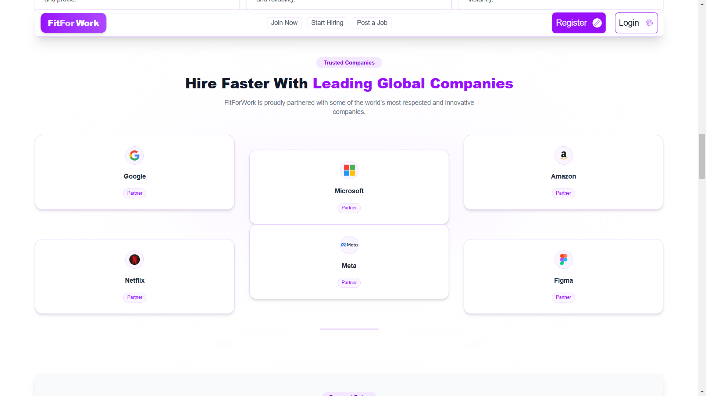
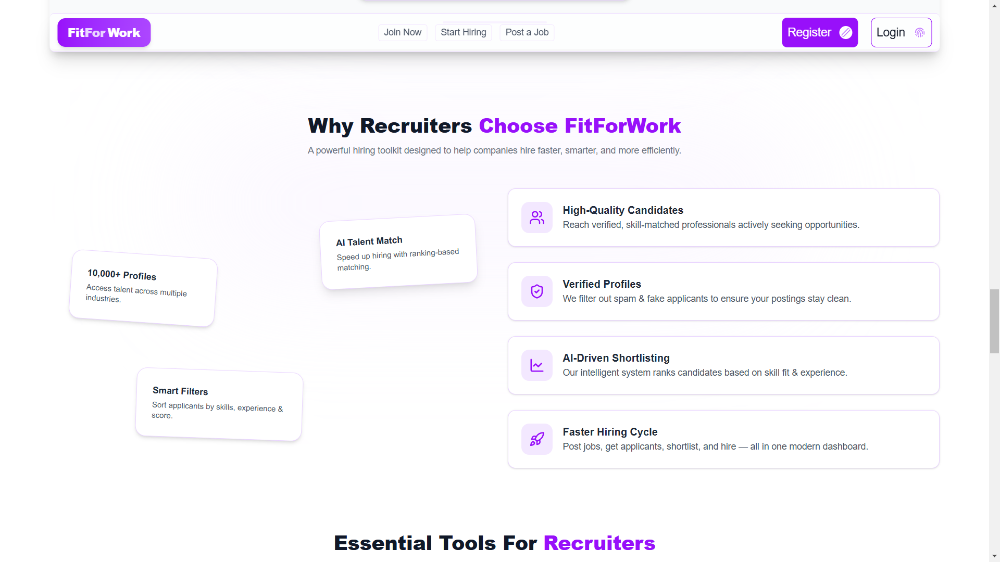

<div align="center">

# 🚀 FitForWork – AI-Powered Job & Hiring Platform  
### MERN Stack • Multi-Role System • Premium SaaS UI • Real-Time Dashboards  
A modern job-seeking and recruitment platform built using **MERN**, featuring separate dashboards for Job Seekers, Employers, and Admin with powerful AI-driven matching, analytics, and a world-class UI.

</div>

---

# 📌 Table of Contents  
- [✨ Overview](#-overview)  
- [🌟 Features](#-features)  
- [🎯 Tech Stack](#-tech-stack)  
- [🏗️ System Architecture](#️-system-architecture)  
- [🧩 Project Structure](#-project-structure)  
- [📸 Screenshots (Recommended)](#-screenshots-recommended)  
- [⚙️ Installation](#️-installation)  
- [🔐 Environment Variables](#-environment-variables)  
- [🛠️ Scripts](#️-scripts)  
- [📊 Dashboards](#-dashboards)  
- [📡 APIs](#-apis)  
- [🤖 AI Features](#-ai-features)  
- [📈 SEO Keywords](#-seo-keywords)  
- [🙌 Contributing](#-contributing)  
- [📄 License](#-license)

---

# ✨ Overview  
**FitForWork** is a modern, AI-powered recruitment SaaS platform where:

- **Job Seekers** find relevant jobs
- **Employers** post and manage job listings, track applicants, and hire
- **Admins** monitor platform activity, manage users, verify employers, and maintain transparency

The platform features:
- A clean **Purple–White Neon SaaS UI**
- Role-based authentication
- Real-time charts using **Chart.js / React Chart.js**
- Fully responsive layout using **TailwindCSS**
- Interactive dashboards
- Smart job recommendations (AI-ready architecture)
- Optimized for high-performance MERN apps

---

# 🌟 Features  

## 👤 Job Seeker Panel  
- Create & manage profile  
- Upload resume  
- Apply to jobs instantly  
- Track application status  
- Personalized job matches  
- Filter jobs (role, salary, experience, location)

---

## 🏢 Employer Panel  
- Create company profile  
- Post jobs (Full-Time, Part-Time, Internships, Remote, Contract)  
- Smart job posting interface with:
  - Role  
  - Skills  
  - Salary Range  
  - Deadline  
  - Job Type  
  - Experience Level  
- Manage applicants  
- View analytics (applicant count, views, timeline, job performance)  
- Hire candidates  
- Manage hired employees database  

---

## 🛡️ Admin Panel  
- User management (Seekers, Employers)  
- Monitor job postings  
- Delete spam accounts  
- Role upgrades (promote user to employer)  
- View platform-wide insights  
- Transaction logs (if implemented later)  

---

## 🎨 Frontend Highlights  
- Fully custom **Neon Purple / Pink SaaS Theme**  
- TailwindCSS + Lucide Icons  
- Responsive design (mobile → desktop)  
- Framer Motion animations  
- Parallax elements  
- Gradient text headings  
- Floating cards + modern sections  
- Reusable component structure  

---

## 📊 Dashboards  
FitForWork includes professional analytics dashboards:

### Employer Dashboard  
- Total Jobs Posted  
- Active vs Inactive Jobs  
- Total Applicants  
- Hired Candidates  
- Application Trend Graph  
- Job Popularity Chart  

### Seeker Dashboard  
- Profile Strength  
- Applications Timeline  
- Saved Jobs  
- Resume Score (AI-based future)  

### Admin Dashboard  
- Platform Stats  
- Graphs for Users, Jobs, Employers  
- Recent Activities Table  

---

# 🎯 Tech Stack  

## 🌐 Frontend  
- React.js  
- React Router  
- Tailwind CSS  
- Lucide Icons  
- Chart.js / React-Chartjs-2  
- Axios  
- Framer Motion  

## 🧠 Backend  
- Node.js  
- Express.js  
- MongoDB + Mongoose  
- JWT Authentication  
- Multer (file uploads)  

## 🗄️ Database  
- MongoDB Atlas  

---

# 🏗️ System Architecture  

```

Frontend (React)
|
| Axios REST API Calls
|
Backend (Node + Express)
|
| Mongoose ORM
|
MongoDB (Atlas)

```

Authentication:  
- JWT-based login  
- Role middleware (seeker/employer/admin)  
- Protected routes  

---

# 🧩 Project Structure  

```

FitForWork/
│
├── client/                # React frontend
│   ├── src/
│   │   ├── Components/
│   │   ├── Pages/
│   │   ├── ContextAPI/
│   │   ├── assets/
│   │   ├── App.js
│   │   └── index.js
│   └── package.json
│
├── server/                # Node backend
│   ├── routes/
│   ├── controllers/
│   ├── models/
│   ├── middleware/
│   ├── config/
│   ├── server.js
│   └── package.json
│
└── README.md

```

---

# 📸 Screenshots (Recommended)

## 📸 UI Preview (Screenshots)

<table>
  <tr>
    <td align="center">
      <strong>Intro of Landing Page</strong><br/>
      
    </td>
    <td align="center">
      <strong>Mobile UI – Phone View</strong><br/>
      
    </td>
  </tr>

  <tr>
    <td align="center">
      <strong>Steps to Apply</strong><br/>
      
    </td>
    <td align="center">
      <strong>Recruiter Pricing</strong><br/>
      
    </td>
  </tr>

  <tr>
    <td align="center">
      <strong>Companies List</strong><br/>
      
    </td>
    <td align="center">
      <strong>Recruiter Benefits</strong><br/>
      
    </td>
  </tr>
</table>


# ⚙️ Installation

## 1️⃣ Clone the repository
```bash
git clone https://github.com/your-username/FitForWork.git
cd FitForWork
````

## 2️⃣ Install client & server dependencies

```bash
cd client
npm install

cd ../server
npm install
```

## 3️⃣ Start the project

### Start backend:

```bash
npm run dev
```

### Start frontend:

```bash
npm start
```

---

# 🔐 Environment Variables

Create a `.env` file in `/server`:

```
MONGO_URI=your_mongodb_connection
JWT_SECRET=your_jwt_secret
CLOUDINARY_KEY=optional
CLOUDINARY_SECRET=optional
CLOUDINARY_CLOUD_NAME=optional
PORT=5000
```

---

# 🛠️ Scripts

### Backend

```bash
npm run dev   # start server in development
```

### Frontend

```bash
npm start
npm run build
```

---

# 🤖 AI Features (Future Enhancements)

* AI resume analysis
* AI job recommendations
* AI candidate shortlisting
* Auto-scoring applications
* AI chat for interview preparation
* Recommendation engine

---


# 🙌 Contributing

Pull requests are welcome.
For major changes, please open an issue first.

---

# 📄 License

This project is licensed under the **MIT License**.

---

# 🎉 Final Notes

FitForWork is built with scalability, modern UI principles, and production-grade architecture in mind.
Perfect as:

* A portfolio project
* A real SaaS startup
* A scalable hiring platform
* A coding interview showcase


---

## 🔍 SEO Keywords (For Better Discoverability)

fitforwork, mern job portal, mern project, react job portal, node express job board, 
mern stack website, ai job recommendation, employer dashboard mern, job seeker dashboard mern,
react tailwind ui project, mern fullstack saas, job hiring platform mern, 
mern recruitment platform, react animated landing page, mongodb job application system
